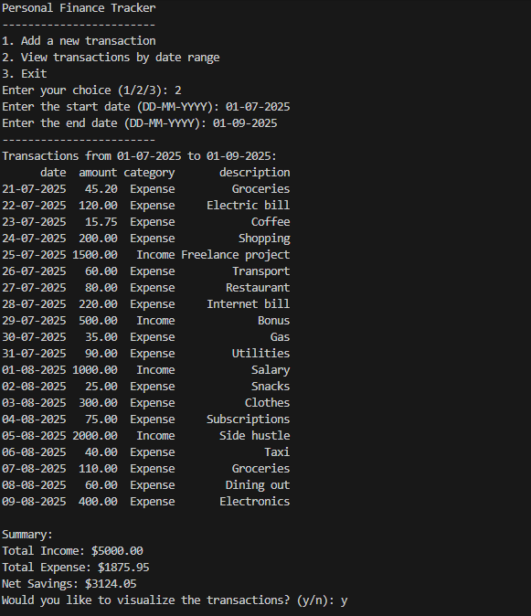
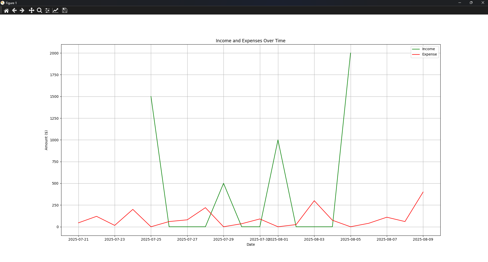

# Personal Finance Tracker (Python)

A simple command-line Personal Finance Tracker built with Python.  
This program allows you to record, view, and visualize your income and expenses over time using a CSV file.




---

## Features

- Add new transactions (income or expense)
- Store data in a CSV file
- Filter transactions by date range
- View financial summaries (income, expenses, savings)
- Visualize income vs expenses with a line chart

---

## Modules Used

### 1. pandas
- Used for data manipulation and analysis
- Reads and filters CSV data
- Handles date conversions and calculations

### 2. csv
- Handles writing new transaction entries to the CSV file

### 3. datetime
- Parses and formats dates
- Enables filtering between date ranges

### 4. matplotlib
- Used to create visualizations
- Plots income and expenses over time

### 5. time
- Adds a simple exit animation (countdown effect)

### 6. custom module: `data_entry`
- Handles user input validation
- Functions include:
  - `get_date()`
  - `get_amount()`
  - `get_category()`
  - `get_description()`

---

## File Structure
    Personal finance tracker/
      │
      ├── main.py # Main program logic
      ├── data_entry.py # Input helper functions
      ├── finance_data.csv # Stored transaction data
      └── README.md # Project documentation

  
---

##  How to Run

1. Make sure you have Python installed
2. Install required libraries:
   ```bash
   pip install pandas matplotlib
   ```
3. Run the program:
```bash
python main.py
```
## How It Works

### 1. Add Transaction
- Enter date, amount, category (Income/Expense), and description  
- Data is saved into `finance_data.csv`  

### 2. View Transactions
- Input a start and end date  
- Program displays:
  - All transactions in range  
  - Total income  
  - Total expenses  
  - Net savings  

### 3. Visualization
- Option to generate a line chart  
- Shows daily income and expenses over time  

# Author

Built as a personal project to practice:
- Python programming
- Data analysis with pandas
- Data visualization